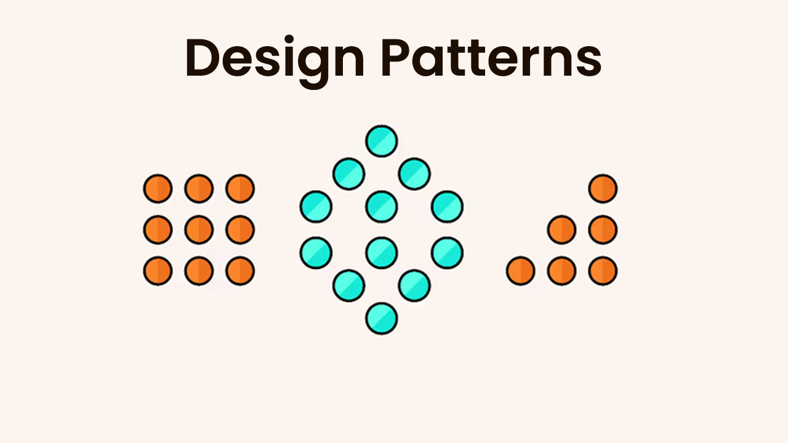

# Design-Patterns

 ## Behavioural Patterns

| #   | Pattern Name | Context (The Problem)                         | Classes With Description                                                                                                                                                                                                                                                                                                                                                                                                                                                                                                                                                                                                                                                                                               |                                             
|-----|--------------|-----------------------------------------------|------------------------------------------------------------------------------------------------------------------------------------------------------------------------------------------------------------------------------------------------------------------------------------------------------------------------------------------------------------------------------------------------------------------------------------------------------------------------------------------------------------------------------------------------------------------------------------------------------------------------------------------------------------------------------------------------------------------------|
| 1   | Memento      | Implement Undo mechanism Like (CTRL + Z)      | `Memento:` is a value object that acts as a snapshot of the originator’s state. It’s a common practice to make the memento immutable and pass it the data only once, via the constructor   `Caretaker:`  knows not only “when” and “why” to capture the originator’s state, but also when the state should be restored `Originator:` class can produce snapshots of its own state, as well as restore its state from snapshots when needed.                                                                                                                                                                                                                                                                    |                                             
| 2   | State        | Object will behave based on the current state | `State:` interface declares the state-specific methods. These methods should make sense for all concrete states because you don’t want some of your states to have useless methods that will never be called   `Context:` stores a reference to one of the concrete state objects and delegates to it all state-specific work. The context communicates with the state object via the state interface. The context exposes a setter for passing it a new state object. `Concrete States:`   provide their own implementations for the state-specific methods. To avoid duplication of similar code across multiple states, you may provide intermediate abstract classes that encapsulate some common behavior |